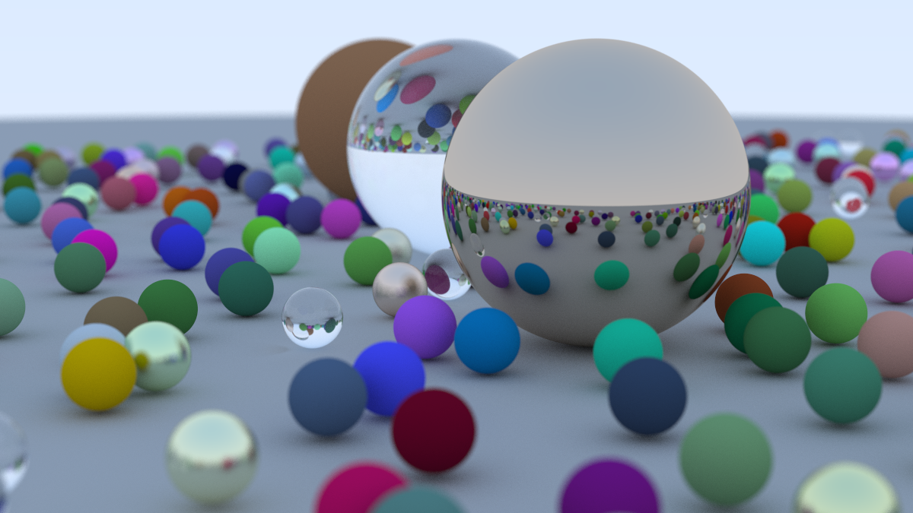

# C++ Path Tracer - Ray Tracing in One Weekend

This is a modern C++ implementation of the path tracer described in Peter Shirley's book, _Ray Tracing in One Weekend_. The project follows the book's structure to build a renderer from scratch, covering fundamental concepts of computer graphics and culminating in the iconic cover image of randomly scattered spheres.

This project was undertaken to build a deep, practical understanding of C++, modern memory management (RAII), and rendering algorithms.

## Final Render

Here is the final scene, rendered at 1200x675 with 500 samples per pixel, demonstrating all the implemented features.



## Features Implemented

*   **Physically-Based Rendering:** A full path tracing implementation that simulates the behavior of light.
*   **Modern C++ & RAII:** Employs `std::unique_ptr` and `std::shared_ptr` for robust, exception-safe memory management, adhering to the RAII (Resource Acquisition Is Initialization) principle.
*   **Materials:** Support for multiple material types with distinct physical properties:
    *   Diffuse (Lambertian) surfaces
    *   Metals with tunable roughness (fuzzy reflection)
    *   Dielectrics (glass, water) with refraction using Snell's Law and reflection using Schlick's approximation.
*   **Positionable Camera:** A fully configurable camera with adjustable Field of View (FoV).
*   **Defocus Blur:** Realistic depth-of-field effect simulated with a thin lens approximation.
*   **Antialiasing:** High-quality edges achieved through multi-sampling per pixel.
*   **Object-Oriented Design:** A clean structure using abstract classes for hittable objects (spheres) and materials.

## Building and Running

This project uses a `Makefile` for building and running.

### Prerequisites

*   A C++17 compliant compiler (the Makefile is configured for `g++`)
*   GNU Make

### Steps

1.  **Clone the repository:**
    ```sh
    git clone https://github.com/your-username/ray-tracing-in-one-weekend.git
    cd ray-tracing-in-one-weekend
    ```

2.  **Build and Run (All-in-one):**
    The simplest way to run the project is to use the default `make` command. This will compile the code, run the executable, and generate `image.ppm` in the root directory.
    ```sh
    make
    ```

### Other `make` Commands

*   **Build Only:** To compile the source code into an executable named `image_generator` without running it:
    ```sh
    make build
    ```

*   **Run Manually:** If you have already built the executable, you can run it with:
    ```sh
    make run
    ```
    Alternatively, you can run the executable directly and redirect the output:
    ```sh
    ./image_generator > image.ppm
    ```

*   **Clean Up:** To remove the executable, object files, and the generated image:
    ```sh
    make clean
    ```

## Future Work & To-Do

This project serves as a strong foundation for a more advanced renderer. The next steps are guided by the second book in the series and other common high-performance techniques.

*   **Implement Features from _Ray Tracing: The Next Week_**:
    *   [ ] **Bounding Volume Hierarchy (BVH)** to dramatically accelerate rendering of complex scenes.
    *   [ ] **Texture Mapping** to apply images and procedural patterns (Perlin noise) to surfaces.
    *   [ ] **Motion Blur** to simulate moving objects.
    *   [ ] **More Shapes** like Quads and Boxes to build more interesting scenes.
    *   [ ] **Light Sources** by creating emissive materials.

*   **Performance and Code Quality Enhancements**:
    *   [ ] **Multithreading** to parallelize the render loop and significantly reduce render times.
    *   [ ] **Add a different image output format** like PNG, using a library such as `stb_image_write`.

## Acknowledgments

This project would not have been possible without the incredible educational resource, _Ray Tracing in One Weekend_. A huge thank you to **Peter Shirley, Trevor David Black, and Steve Hollasch** for making this knowledge so accessible.

For anyone interested in learning computer graphics, I highly recommend visiting the official website: [raytracing.github.io](https://raytracing.github.io/).